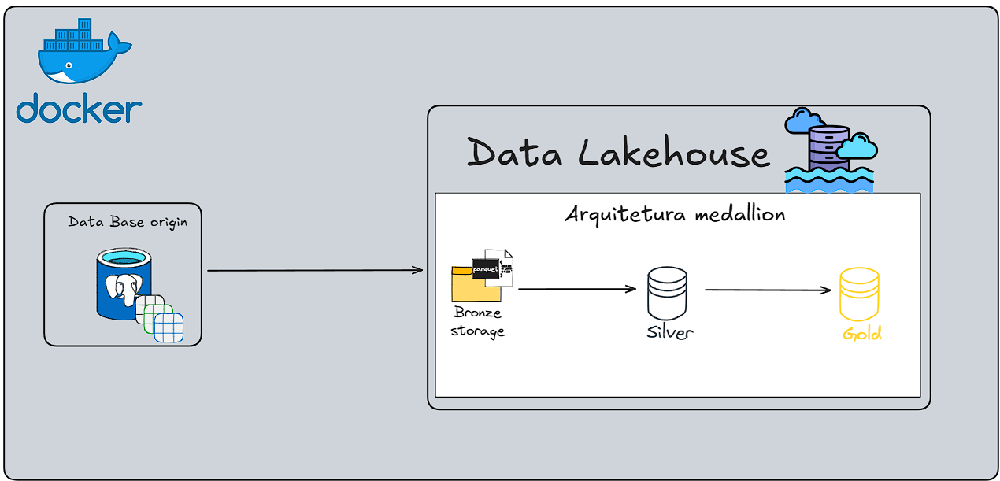

# 🏗️ Arquitetura Medalhão (Bronze, Silver, Gold) e Data Lakehouse
Este projeto implementa um Data Lakehouse utilizando o Supabase como banco de dados para simular um ambiente de armazenamento e processamento de dados. O fluxo de dados segue a Arquitetura Medalhão (Bronze, Silver, Gold), garantindo qualidade, organização e eficiência no processamento dos dados.

## Arquitetrua/Fluxo de Dados até o momento 



obs: Essa arquitetura é uma representação simplificada do fluxo de dados. A arquitetura final do projeto ainda está em desenvolvimento a medida que novas funcionalidades são implementadas no projeto.

## Conceitos importantes

### 📌 Data Lakehouse
Um Data Lakehouse é uma arquitetura híbrida que combina as melhores características de Data Lakes e Data Warehouses. Ele permite armazenar grandes volumes de dados brutos (como um Data Lake) enquanto oferece governança, qualidade e desempenho para consultas analíticas (como um Data Warehouse). Os dados validados e a pipeline funciona a cada 2 meses, garantinando a extração continua dos dados, além de que todo o sistema é validado para garantir a integrade das camadas e não inserir dados repetidos e acabar duplicando os dados do banco.

#### Principais Características:
- Armazena dados estruturados e não estruturados em um único local.
- Suporta processamento de grandes volumes de dados com baixo custo.
- Permite consultas rápidas e eficientes usando SQL e ferramentas analíticas.
- Possui governança e controle de acesso, garantindo segurança e qualidade dos dados.
- Facilita Machine Learning e Análises Avançadas, pois mantém dados históricos em diferentes estágios de processamento (Bronze, Silver, Gold na Arquitetura Medalhão).

### 📌 Arquitetura Medalhão (Bronze, Silver, Gold)
A Arquitetura Medalhão é um modelo de organização de dados dentro de um Data Lakehouse, estruturado em três camadas: Bronze, Silver e Gold. Cada camada representa um nível de processamento e qualidade dos dados.

#### 📂 Bronze
- Dados brutos extraídos de fontes externas.
- Sem limpeza ou transformação.
- Armazenamento de dados em seu formato original.
- Ideal para armazenar dados históricos e brutos para auditoria e rastreabilidade.
- Normalmente armazenados em arquivos (CSV, JSON, Parquet) em backends de armazenamento (S3, Blob Storage, Data Lake).

#### 📂 Silver
- Dados limpos e transformados.
- Estruturados em tabelas relacionais
- Ideal para análises e consultas rápidas.
- Armazenamento de dados prontos para análises e relatórios.

#### 📂 Gold
- Dados agregados e prontos para análises avançadas.
- Estruturados em tabelas analíticas.
- Ideal para Machine Learning, Business Intelligence e Análises Avançadas.
- Armazenamento de dados prontos para insights e tomada de decisão.

### 📌 Tecnologias e conceitos utilizados
- [Python](https://www.python.org/)
- [Pandas](https://pandas.pydata.org/)
- [Supabase](https://supabase.com/)
- [Arquitetura Medalhão (Bronze, Silver, Gold)](https://www.databricks.com/br/glossary/medallion-architecture)
- [Data-lakehouse](https://www.databricks.com/glossary/data-lakehouse)

### 📂 Estrutura do Projeto
```bash
📂 pipeline-elt-lakehouse-medallion
├── 📂 images-readme/               → Imagens utlizadas no readme
├── 📂 src/                         → Código-fonte do ETL
│ ├── 📂 elt/                       → Pipelines de ETL
│ │ ├── 📂 bronze/                  → Extração dos dados brutos
│ │ │ ├── main.py                   → Script de extração dos dados brutos e carregamento no schema bronze
│ │ ├── 📂 silver/                  → Limpeza e transformação dos dados da camada bronze e upload na camada silver
│ │ │ ├── clientes.py               → Limpeza e transformação dos dados dos clientes
│ │ │ ├── LakehouseConnection.py    → Conexão com o Supabase
│ │ │ ├── main.py                   → Script de limpeza e transformação dos dados e carregamento no schema silver
│ │ │ ├── pedidos.py                → Limpeza e transformação dos dados dos pedidos
│ │ │ ├── produtos.py               → Limpeza e transformação dos dados dos produtos
│ │ ├── 📂 gold                    → Agregação dos dados da camada silver e upload na camada gold
│     ├──LakehouseConnection.py     → Conexão com o Supabase
│     ├── main.py                   → Script de agregação dos dados e carregamento no schema gol
│
├── 📄 .env.example                 → Exemplo de arquivo de variáveis de ambiente
├── 📄 .gitignore                   → Arquivo de configuração do Git
├── 📄 README.md                    → Documentação do projeto
├── 📄 requirements.txt             → Dependências do projeto
```

### Keys -> Chaves para controle de fluxo do pipeline
| key      | Descrição |
| :------- | :----: | 
| 135        | Ocorreu um erro na camada bronze pois não existem dados novos para serem inseridos |
| 246        | Sucesso na transação de dados na camada bronze e pode seguir em frente |
| 357        | Não foi possivel inserir os dados na camada silver pois não existem novos dados para tratamento e inserção |
| 468        | Sucesso na transação de dados na camada bronze e pode seguir em frente |
| 579        | Não foi possivel inserir os dados na camada gold pois não existem dados novos |
| 680        | Sucesso na transação dos dados na camada gold |


## 📌 1️⃣ Criando a Arquitetura Medalhão no Supabase
No Supabase, organizamos os dados em três esquemas:

📂 Bronze → Dados brutos extraídos.
📂 Silver → Dados limpos e transformados.
📂 Gold → Dados agregados e prontos para análise.

### 🔹 Criando os Esquemas no Supabase
execute o código SQL no SQL Editor do Supabase para criar os esquemas:
```sql
-- Criar os esquemas para a arquitetura medalhão
CREATE SCHEMA silver;
CREATE SCHEMA gold;
```

## 📌 2️⃣ Criando a Camada Bronze

#### 📂 Esquema bronze
Para a camada Bronze, vamos criar um bucket no Supabase para armazenar os dados brutos extraídos. O bucket é um local de armazenamento de arquivos (CSV, JSON, Parquet) que pode ser acessado por APIs e ferramentas de análise.
Para criar um bucket no Supabase, siga as etapas abaixo:
###### Passo a Passo para Criar um Bucket no Supabase:
1. Acesse a página do Supabase e faça login na sua conta.
2. Acesse o seu projeto no Supabase.
3. Acesse a opção "Storage" no menu lateral.
4. Clique no botão "New Bucket" para criar um novo bucket.
5. Preencha o nome do seu bucket e clique em "Create Bucket". Nome proposto: "bronze-bucket".
6. Agora você tem um bucket para armazenar os dados brutos extraídos.
Agora vamos dar as permissões para o schema bronze. Acesse o SQL Editor do Supabase e execute o código abaixo:
```sql
-- Enable row-level security
ALTER TABLE storage.objects ENABLE ROW LEVEL SECURITY;

-- Policy for SELECT operations
CREATE POLICY objects_select_policy ON storage.objects FOR SELECT
  USING (auth.role() = 'authenticated');

-- Policy for INSERT operations WITH CHECK !
CREATE POLICY objects_insert_policy ON storage.objects FOR INSERT
  WITH CHECK (auth.role() = 'authenticated');

-- Policy for UPDATE operations
CREATE POLICY objects_update_policy ON storage.objects FOR UPDATE
  USING (auth.role() = 'authenticated');

-- Policy for DELETE operations
CREATE POLICY objects_delete_policy ON storage.objects FOR DELETE
  USING (auth.role() = 'authenticated');


CREATE POLICY "Acesso Total"
ON storage.objects
FOR ALL
USING (true);
```

Com isso já temos o esquema bronze criado e configurado no Supabase. Agora podemos iniciar a extração dos dados brutos.


## 📌 3️⃣ Criando a Camada Silver (Transformação)
Agora aplicamos limpeza e transformação nos dados.

```sql
CREATE TABLE silver.clientes (
    id TEXT PRIMARY KEY,
    nome TEXT,
    email TEXT,
    telefone TEXT,
    cidade TEXT,
    idade INT,
    data_ingestao TIMESTAMP DEFAULT CURRENT_TIMESTAMP
);

CREATE TABLE silver.produtos (
    id TEXT PRIMARY KEY,
    nome_produto TEXT,
    categoria TEXT,
    preco NUMERIC,
    estoque INT,
    data_ingestao TIMESTAMP DEFAULT CURRENT_TIMESTAMP
);

CREATE TABLE silver.pedidos (
    id TEXT PRIMARY KEY,
    id_cliente TEXT REFERENCES silver.clientes(id)
    id_produto TEXT REFERENCES silver.produtos(id),
    quantidade INT,
    status TEXT,
    valor_total NUMERIC,
    data_pedido DATE,
    data_ingestao TIMESTAMP DEFAULT CURRENT_TIMESTAMP
);
```
Agora vamos dar as permissões para o schema silver:
```sql
GRANT USAGE ON SCHEMA silver TO anon;

GRANT SELECT, INSERT, UPDATE, DELETE ON TABLE silver.clientes TO anon;
GRANT SELECT, INSERT, UPDATE, DELETE ON TABLE silver.produtos TO anon;
GRANT SELECT, INSERT, UPDATE, DELETE ON TABLE silver.pedidos TO anon;
```

## 📌 4️⃣ Criando a Camada Gold (Análises)
Agora agregamos os dados para análises.
```sql
CREATE TABLE gold.analise_clientes_pedidos (
    id_cliente TEXT PRIMARY KEY,
    nome TEXT,
    cidade TEXT,
    idade INT,
    total_pedidos INT,
    total_gasto NUMERIC,
    data_primeiro_pedido DATE,
    data_ultimo_pedido DATE,
    categorias_compradas TEXT, -- Lista de categorias
    produtos_comprados TEXT -- Lista de produtos
);
CREATE TABLE gold.analise_produtos (
    id_produto TEXT PRIMARY KEY,
    nome_produto TEXT,
    categoria TEXT,
    total_vendido INT,
    total_receita NUMERIC,
    estoque_atual INT
);
```
##### Explicando as colunas das tabelas gold:
###### gold.analise_clientes_pedidos
- total_gasto → Soma do valor total do pedido (igual ao pedido, pois cada cliente tem um único pedido).
- status_pedido → Status do pedido (Pago, Cancelado, etc.).
- data_pedido → Data da compra.
- categoria_produto → Categoria do produto comprado.
- nome_produto → Nome do produto comprado.
###### gold.analise_produtos
- total_vendido → Soma das quantidades vendidas de cada produto.
- total_receita → Soma do valor total gerado por esse produto.
- estoque_atual → Estoque restante do produto.


Agora vamos dar as permissões para o schema gold:
```sql
GRANT USAGE ON SCHEMA gold TO anon;

GRANT SELECT, INSERT, UPDATE, DELETE ON TABLE gold.analise_clientes_pedidos TO anon;
GRANT SELECT, INSERT, UPDATE, DELETE ON TABLE gold.analise_produtos TO anon;
```

#### 📌 5️⃣ Configurando a exposição dos schemas no lakehouse
Para permitir interação externa e acesso via API aos schemas, é necessário configurar corretamente as permissões no Supabase.

1️⃣ Acesse o painel do Supabase e vá até as configurações de política de acesso.
2️⃣ Habilite o acesso às tabelas dos schemas Bronze, silver e gold para usuários anônimos e autenticados.
3️⃣ Garanta que as permissões de leitura e escrita estejam corretas.

#### 📌 Exemplo de configuração no Supabase:
Antes de iniciar a extração e carga dos dados, é essencial verificar as limitações de requisição do Supabase para garantir que o processamento seja eficiente.

#### 📌 Limites definidos para requisições:
- Extração de dados: Limitada a 100.000 registros por requisição.
- Inserção de dados: Limitada a 10.000 registros por requisição.
🔹 Implementação do Batch Processing
Para garantir que todos os dados sejam inseridos corretamente no schema Bronze, silver e gold, utilizamos um sistema de processamento em lote (batch processing). Esse sistema divide os dados em pequenos blocos de 10.000 registros por requisição, otimizando a performance e evitando erros de timeout.


#### 📌 6️⃣ Executando o projeto
1️⃣ Clone o repositório:
```bash
git clone [link do repositório]
```
2️⃣ Instale as dependências:
```bash
pip install -r requirements.txt
```
3️⃣ Renomeie o arquivo .env.example para .env e preencha as variáveis de ambiente:
```bash
# Databse destination
LAKEHOUSE_URL="adicione a url do supabase aqui"
LAKEHOUSE_KEY="adicione a chave do supabase aqui"
BUCKET_NAME="bronze-bucket"

# Database origin
SUPABASE_URL="adicione a url do supabase de onde os dados serão extraídos"
SUPABASE_KEY="adicione a chave do supabase de onde os dados serão extraídos"
```
4️⃣ Execute o projeto da da pipeline elt completa (bronze, silver, gold):
```bash
docker-compose build
docker-compose up -d
```

#### 📌 7️⃣ Conclusão
Este projeto implementa um Lakehouse gratuito usando Supabase e Arquitetura Medalhão para organizar os dados de uma loja fictícia.

✅ Criamos as Camadas Bronze, Silver e Gold.
✅ Transformamos e estruturamos os dados.
✅ Agora os dados estão prontos para análise! 🚀🔥
✅ Criar um Pipeline de Dados.


#### 📌 8️⃣ Próximos Passos
✅ Finalizamos a Arquitetura Medalhão com sucesso! 🎉
🚀 Agora podemos avançar para novos desafios:

1️⃣ Criar um Dashboard para análise dos dados.
2️⃣ Criar uma API para disponibilizar os dados.
