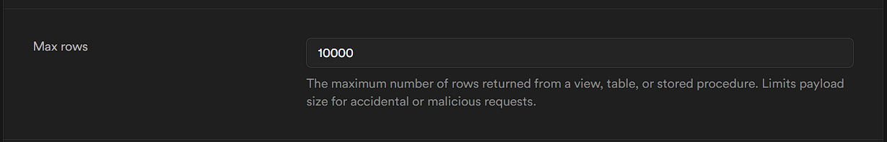

pandas, lakehouse, supabase, dashboard, disponibilizar os dados em uma api, arquitetura medalhão(bronze, silver, gold), pipeline Prefect

Vamos criar um projeto de ponta a ponta, desde a extração dos dados até a disponibilização de um dashboard e uma API para acessar os dados. Vamos usar o pandas para extrair os dados do supabase e subir em nosso data lakehouse (vou suar o supabase para simular pois é uma opção gratuita), vamos usar a arquitetura medalhão(bronze, silver, gold) e o Prefect para criar um pipeline de dados.

Os dados que vamos usar já estão disponíveis no supabase, são dados de uma loja fictícia que vende produtos e tem clientese e pedidos. Vamos fazer a extração, carregar em nosso data lakehouse, limpar e transformar os dados, criar um dashboard para visualização e disponibilizar os dados em uma API.

vamos começar criando a arquitetura medalhão no supabase.

Como Estruturar a Arquitetura Medalhão no Supabase?
No Supabase, vamos organizar a Arquitetura Medalhão criando três esquemas diferentes para armazenar os dados em diferentes níveis de processamento:

📂 Esquema bronze → Dados brutos extraídos
📂 Esquema silver → Dados limpos e transformados
📂 Esquema gold → Dados agregados e prontos para análise

Essa separação mantém os dados organizados e facilita a governança.

Antes de tudo vamos criar uma organização no supabase e um projeto, nesse projeto vamos acessar a parte de SQL Editor e criar os esquemas bronze, silver e gold.

1️⃣ Criando os Esquemas no Supabase
Acesse o SQL Editor no Supabase e execute:
```sql
-- Criar os esquemas para a arquitetura medalhão
CREATE SCHEMA bronze;
CREATE SCHEMA silver;
CREATE SCHEMA gold;
```
Isso criará três áreas separadas para armazenar os dados de forma organizada.

Agora vamos criar as nossas tabelas no schema bronze primeiro para realizar a extração dos dados e jogar lá:
```sql
CREATE SEQUENCE process_id_seq START 1;

CREATE TABLE bronze.clientes (
    id_cliente TEXT PRIMARY KEY,
    nome TEXT,
    email TEXT,
    telefone TEXT,
    cidade TEXT,
    idade TEXT,
    load_timestamp TIMESTAMP DEFAULT CURRENT_TIMESTAMP,  -- Coluna para a hora do carregamento
    process_id TEXT DEFAULT 'abc' || nextval('process_id_seq')::TEXT
    row_version INT DEFAULT 1  -- Controle de versão do registro (caso haja alterações futuras)
);

CREATE TABLE bronze.produtos (
    id_produto TEXT PRIMARY KEY,
    nome_produto TEXT,
    categoria TEXT,
    preco TEXT,
    estoque TEXT,
    load_timestamp TIMESTAMP DEFAULT CURRENT_TIMESTAMP,  -- Coluna para a hora do carregamento
    process_id TEXT DEFAULT 'abc' || nextval('process_id_seq')::TEXT
    row_version INT DEFAULT 1  -- Controle de versão do registro (caso haja alterações futuras)
);

CREATE TABLE bronze.pedidos (
    id_pedido TEXT PRIMARY KEY,
    id_cliente TEXT REFERENCES bronze.clientes(id_cliente),
    id_produto TEXT REFERENCES bronze.produtos(id_produto),
    quantidade TEXT,
    status TEXT,
    valor_total TEXT,
    data_pedido TEXT,
    load_timestamp TIMESTAMP DEFAULT CURRENT_TIMESTAMP,  -- Coluna para a hora do carregamento
    process_id TEXT DEFAULT 'abc' || nextval('process_id_seq')::TEXT
    row_version INT DEFAULT 1  -- Controle de versão do registro (caso haja alterações futuras)
);
```

Dentro do supabase vamos dar para o nosso schema bronze a permissão de leitura e escrita para o público, para que possamos acessar os dados de fora do supabase.
```sql	
-- Conceder permissões de uso no schema bronze
GRANT USAGE ON SCHEMA bronze TO anon;

-- Conceder permissões de leitura, inserção, atualização e exclusão para a tabela clientes
GRANT SELECT, INSERT, UPDATE, DELETE ON TABLE bronze.clientes TO anon;

-- Conceder permissões de leitura, inserção, atualização e exclusão para a tabela produtos
GRANT SELECT, INSERT, UPDATE, DELETE ON TABLE bronze.produtos TO anon;

-- Conceder permissões de leitura, inserção, atualização e exclusão para a tabela pedidos
GRANT SELECT, INSERT, UPDATE, DELETE ON TABLE bronze.pedidos TO anon;
```

E agora vamos configurar a exposição do nosso schema bronze para permitir interação via API:

Logo após vamos salvar as alterações e vamos executar o código de extração dos dados para o schema bronze.

OBS: Lembrar que para o processo de extrassão devemos verificar a quantidade permitida de dados que podem ser extraídos por requisição, para a nossa logica não ter problemas. Tanto para a extração dos dados quanto para a inserção dos dados no schema bronze.

Para isso eu liberei a quantidade de dados permitida para 200_000 registros por requisição. Porém, para a inserção dos dados no schema bronze, eu liberei a quantidade de dados permitida para 10_000 registros por requisição. E para conseguir enviar todos os dados vamos fazer um sistma em batch para enviar os dados em partes.

quantidade de dados permitida para envio para o schema bronze: 10_000 registros por requisição.


2️⃣ Extração dos Dados para o Schema Bronze
Agora que temos os esquemas bronze, silver e gold criados, vamos extrair os dados do Supabase e carregá-los no schema bronze.
vamos executar o código de extração dos dados para o schema bronze.
```python
python .\src\elt\bronze\main.py
```

3️⃣ Carregando os Dados no Schema Silver
Agora  vamos inicialmente criar as tabelas no schema silver para realizar a limpeza e transformação dos dados:
```sql
CREATE TABLE silver.clientes (
    id_cliente TEXT PRIMARY KEY,
    nome TEXT,
    email TEXT,
    telefone TEXT,
    cidade TEXT,
    idade INT,
    data_ingestao TIMESTAMP DEFAULT CURRENT_TIMESTAMP
);

CREATE TABLE silver.produtos (
    id_produto TEXT PRIMARY KEY,
    nome_produto TEXT,
    categoria TEXT,
    preco NUMERIC,
    estoque INT,
    data_ingestao TIMESTAMP DEFAULT CURRENT_TIMESTAMP
);

CREATE TABLE silver.pedidos (
    id_pedido TEXT PRIMARY KEY,
    id_cliente TEXT REFERENCES silver.clientes(id_cliente),
    id_produto TEXT REFERENCES silver.produtos(id_produto),
    quantidade INT,
    status TEXT,
    valor_total NUMERIC,
    data_pedido DATE,
    data_ingestao TIMESTAMP DEFAULT CURRENT_TIMESTAMP
);
```

Agora vamos dar as permissões para o schema silver:
```sql
GRANT USAGE ON SCHEMA silver TO anon;

-- Conceder permissões de leitura, inserção, atualização e exclusão para a tabela clientes
GRANT SELECT, INSERT, UPDATE, DELETE ON TABLE silver.clientes TO anon;

-- Conceder permissões de leitura, inserção, atualização e exclusão para a tabela produtos
GRANT SELECT, INSERT, UPDATE, DELETE ON TABLE silver.produtos TO anon;

-- Conceder permissões de leitura, inserção, atualização e exclusão para a tabela pedidos
GRANT SELECT, INSERT, UPDATE, DELETE ON TABLE silver.pedidos TO anon;
```

Agora vamos executar o código de limpeza e transformação dos dados e carregar no schema silver:
```python

